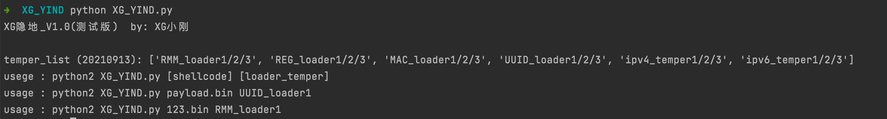
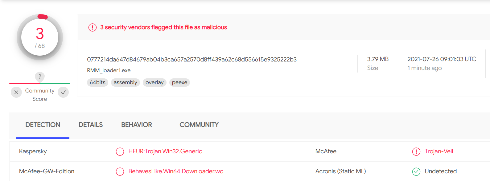
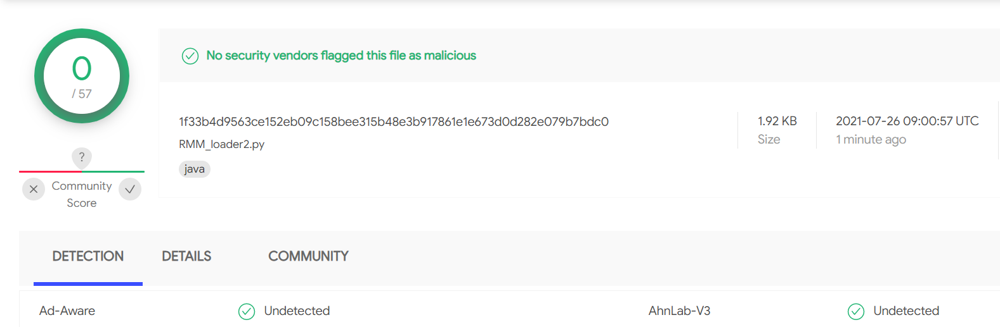
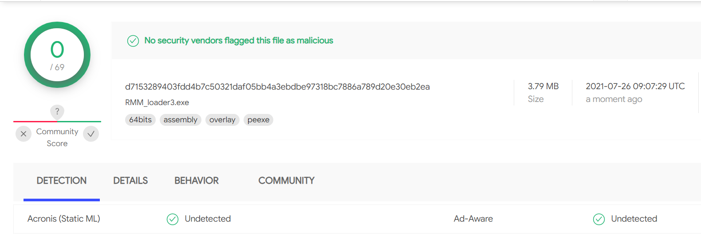
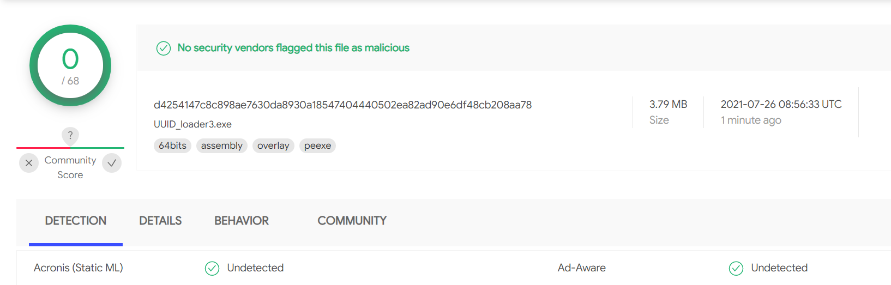

# XG隐地

>  公众号 : XG小刚

用于静态免杀的shellcode加载器，将shellcode进行xor加密后，再base64编码，使用内存加载器加载上线C2


## 使用环境

```
python==2.7
pip install pyinstaller==3.0
```


## 使用方法

目前搭载三种申请内存方式和六种写入内存方式 

temper_list :  ["RMM_loader1/2/3","REG_loader1/2/3","MAC_loader1/2/3","UUID_loader1/2/3","ipv4_temper1/2/3","ipv6_temper1/2/3"]


CS生成64位payload.bin文件（注：32位payload使用x86的python）

选择一个加载器模板，运行后在loader_result文件夹生成相应加载器源文件和exe文件（注：生成exe需要安装pyinstaller）

```
./msfvenom -p windows/x64/exec CMD=calc.exe EXITFUNC=thread -f raw -o payload.bin

usege : python2 XG_YIND.py [shellcode] [loader_temper]
usage : python2 XG_YIND.py payload.bin UUID_loader1
usage : python2 XG_YIND.py 123.bin RMM_loader1
```



# 免杀效果

2021/7/26，效果还可以，就是exe文件在4M左右










# 公众号对应文章：

https://mp.weixin.qq.com/s/_uMFatf4_yfGit-Xu7Ml9A

https://mp.weixin.qq.com/s/-WcEW1aznO2IuCezkCe9HQ

https://mp.weixin.qq.com/s/CSi7iQCg25AIfmqWNAYrhQ

https://mp.weixin.qq.com/s/TdRAiRuts0rSNOKqZxzzmw

https://mp.weixin.qq.com/s/qSs4avStVOIUaAF6Krb-wA

https://mp.weixin.qq.com/s/ZbRG7SGZxCucpQI7cmeDbg
